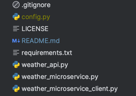

# Weather Microservice

## __Table of Content__

1. Setup and Requirements
   1. OpenWeather API
   2. Requirements
2. File Structures
3. How-To
   1. Server Side
   2. Client Side
      1. Request JSON
      2. get_weather()
      3. get_forecast()
      4. get_air_pollution()
4. More Information on OpenWeather API
5. UML Sequence Diagram

## 1. Setup and Requirement
### OpenWeather API

1. All data are requested from OpenWeather API. You will need to sign up for a free account on their website to obtain an API key.
    >

2. After creating an account, go to <strong>My API Keys</strong> and copy the API key shown in the example below.
    >
    
3. Create a new python file called <strong>config.py</strong> and store the key in the file by adding the line below with your API key.
    >api_key = {API KEY}  # Example api_key = 'abcdefghijklmnopqrstuvqxyz12345'

4. Place the <strong>config.py</strong> file in the base folder with the other weather____.py files
    >
   
### Requirements
1. The library <strong>requirements</strong> is used to send and receive API request from OpenWeather. <strong>pyzmq</strong> is used for microservice communication.
    >pip install requests pyzmq

## File Structure

### weather_api.py
This file contains the class WeatherAPI, which is used to interact with OpenWeather's API. When creating the WeatherAPI object, the file will read the __config.py__ file by default to get the api key. There are three main functions; which are __get_weather()__, __get_forecast()__, and __get_air_pollution()__.

### weather_microservice.py
This is the microservice file and the main file used to run the server. It creates a WeatherAPI object and listens to a specify port. When a request comes in, it passes the request to the API and sends the response when it is received.

### weather_microservice_client.py
This is an example file to help illustrate how to communicate with the weather_microservice.py. This file has the class WeatherMicroserviceClient and three functions, each corresponding to each of the API request. The functions are defined and explained below in the "How-To".

## How-To

### Server Side
1. Open a new terminal and run the script using python and providing a port number for an argument. For example:
    > python weather_microservice.py 5556

### Client Side
1. Open a new terminal and run the client script with the same port number. For example:
    > python weather_microservice_client.py 5556
2. Call to the server side will require sending two messages
   1. First message is the "function" (in JSON format); What are you asking for? (weather, forecast, or air_pollution)
   2. Second message is the request JSON (Defined Below)

#### Request JSON
1. The request must include a __cityName__.
2. Optionally, it can include __state__.
3. Additionally, it can include __country__, as long as a __state__ is also provided.
4. Example:
<pre>
import json

example1 = json.dumps({'cityName': 'seattle'})
example2 = json.dumps({'cityName': 'new york', 'state': ny})
example3 = json.dumps({'cityName': 'san francisco', 'state': 'ca', 'country': 'usa'})
</pre>

#### get_weather()
<pre>
def get_weather(self, parameter: json):
    self._socket.send_json(json.dumps({'function': 'weather'}))
    self._socket.send_json(parameter)
    response = self._socket.recv_json()
    print(response)
</pre>
1. To get the weather, first send a JSON message to server with <code>json.dumps({'function': 'weather'})</code> 
2. Second, send the request JSON (Example above in "Request JSON")
3. Wait for response back

#### get_forecast()
<pre>
def get_forecast(self, parameter: json):
    self._socket.send_json(json.dumps({'function': 'forecast'}))
    self._socket.send_json(parameter)
    response = self._socket.recv_json()
    print(response)
</pre>
1. To get the forecast, first send a JSON message to server with <code>json.dumps({'function': 'forecast'})</code> 
2. Second, send the request JSON (Example above in "Request JSON")
3. Wait for response back

#### get_weather()
<pre>
def get_air_pollution(self, parameter: json):
    self._socket.send_json(json.dumps({'function': 'air_pollution'}))
    self._socket.send_json(parameter)
    response = self._socket.recv_json()
    print(response)
</pre>
1. To get the air pollution, first send a JSON message to server with <code>json.dumps({'function': 'air_pollution'})</code> 
2. Second, send the request JSON (Example above in "Request JSON")
3. Wait for response back

## More information on OpenWeather API
### Current Weather Data
1. Source
   1. https://openweathermap.org/current#example_JSON
2. Useful information on parsing data
   1. Pulls the current weather for the specify location
   2. Parsed data
      3. "weather" and "main" will have most of the data.
      4. "visibility", "wind", "rain" are also useful

### Forecast Data
1. Source
   1. https://openweathermap.org/forecast5#example_JSON
2. Useful information on parsing data
   1. This pulls 5 days of forecast separated by 3 hours. 
      1. For example. 2023-11-01 12:00 PM, 2023-11-01 3:00 PM, 2023-11-01 6:00 PM... 2023-11-05 9:00 AM
   2. Parsed data
      1. Each item under "list" are the forecast. Use "dt" field to find out the datetime
      2. Each of the forecast will have similar information as current weather

### Air Pollution
1. Source
   1. https://openweathermap.org/api/air-pollution#descr
2. Useful information on parsing data
   1. Pulls the current air pollution
   2. Parsed Data
      1. The data is also under "list"
      2. "main" in "list" will have the "aqi". This is a numeric range between 1 and 5, Where 1 = Good, 2 = Fair, 3 = Moderate, 4 = Poor, 5 = Very Poor.

## UML Sequence Diagram
<section>
    

</section>
